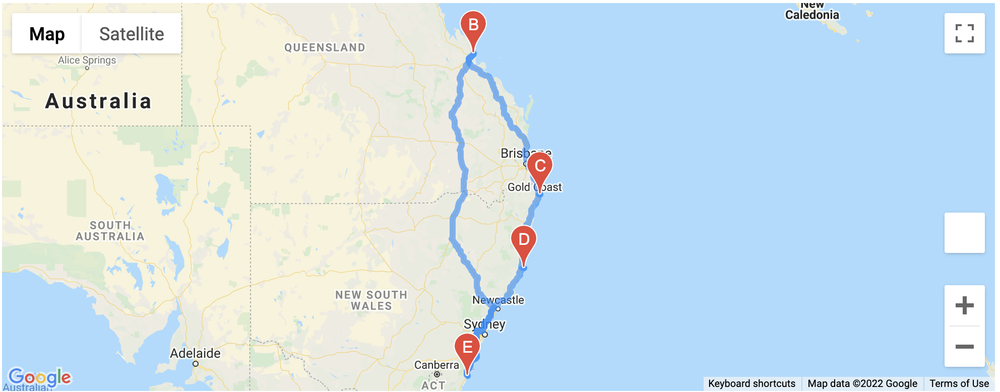

# world_weather_analysis
Analysis of World Weather for PlanMyTrip  

## Overview
This repository was created to capture the code and end product of the code for the following outputs.  
* A weather database of 500+ cities, from latitude and longitude coordinates generated at random, gathering today's weather data;  
* A search of cities from the weather database that match a max temperature range, and gather hotel data from google places;
* A driving itinerary comprising four cities chosen for their proximity from the previously narrowed search.

## Resources
Software: PythonData Dev Environment (Python 3.7.11), Jupyter Notebook 6.4.6
Dependencies:  
* For Weather_Database.ipynb: pandas, matplotlib.pylot, numpy, citipy, requests, time, datetime
* For Vacation_Search.ipynb and Vacation_Itinerary.ipynb: pandas, requests, gmaps  
APIs: openweather, google maps

## Outputs
* WeatherPy_Database.csv: 500+ cities with weather and hotel data
* WeatherPy_vacation.csv: select cities within the max temperature range
* WeatherPy_vacation_map.png: map with markers for all selected cities
* WeatherPy_tavel_map.png: map with markers and driving itinerary for four selected cities
* WeatherPy_tavel_map_markers.png: map with markers containing hotel and weather information for four selected cities

## Summary
This project provided significant opportunities to work with APIs, both receiving data from openweather and google maps, and for creating maps in google using multiple layers and markers. Below you can see one example map from this project, showing the driving itinerary for four cities in Australia.

